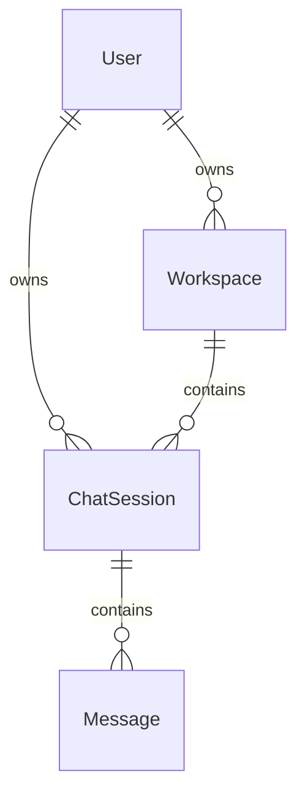
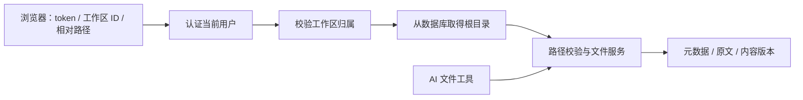

# 工作空间后端开发交接说明

交付日期：2026-10-09。项目位置：`D:\P\Codelin`。

这次修改把服务器上的项目目录变成一个独立的「工作区」，让登录用户可以通过 API 浏览、读取和编辑自己的文件，并让多个对话共享同一份项目。后端能力已实现，现有数据库已迁移。前端现已接入目录面板、Monaco 编辑器标签页、版本冲突处理和响应式聊天布局，完整使用说明见项目根目录 README。

本文解释代码实现、设计取舍和实际交付状态。请求参数和完整响应示例见 [WORKSPACE_API.md](D:/P/Codelin/backend/WORKSPACE_API.md)。

## 1. 这次交付了什么

| 能力 | 已实现的行为 |
| --- | --- |
| 用户工作区 | 创建、查询当前用户的工作区；不向客户端返回服务器绝对路径 |
| 目录浏览 | 获取当前目录的直接子项，目录优先、名称自然排序，支持分页 |
| 文件打开 | 返回完整 UTF-8 原文和内容版本，供编辑器使用 |
| 文件保存 | 要求提交读取时的版本，发生冲突时拒绝覆盖 |
| 创建内容 | 新建文件或目录；目标已存在时拒绝覆盖 |
| 会话绑定 | 多个会话可绑定同一个工作区；支持按工作区查询会话 |
| AI 与编辑器协作 | AI 文件工具和 HTTP 文件接口使用同一套读写服务及跨进程锁 |
| 更新通知 | AI 写文件成功后发送 `file_changed`，命令正常返回后发送 `workspace_changed` |
| 数据兼容 | 接管已有会话目录，不搬迁项目文件；旧前端仍可用空请求体创建会话 |

本次还处理了关联会话删除、审批恢复文本入库和异步执行中的同步工具调用。之前已经修复的 `sse_events()` 缺少 `session_id` 问题也纳入了回归验证。

## 2. 数据模型为什么这样改

原来目录路径直接存在 `ChatSession.workspace_path` 中，目录与某次对话绑定。现在增加 `Workspace` 表，让项目文件的生命周期独立于对话。



新增表 `workspaces` 的字段：

| 字段 | 含义 |
| --- | --- |
| `id` | 32 字符工作区 ID |
| `user_id` | 所属用户，关联 `users.id`，有索引 |
| `name` | 展示名称，最多 128 字符 |
| `root_path` | 服务器上的工作区根目录，由后端维护 |
| `created_at` | 创建时间 |

`chat_sessions` 新增非空的 `workspace_id` 外键和索引。保留原来的 `workspace_path` 字段以兼容旧数据，新会话也会填写该字段；普通聊天请求使用 `Workspace.root_path` 作为实际根目录。

新工作区默认位于 `D:\P\Codelin\backend\workspaces\{user_id}\{workspace_id}`。默认根目录根据代码文件的位置计算，不依赖启动进程的当前目录；可以通过 `WORKSPACE_ROOT` 覆盖。旧目录继续使用迁移时接管的路径。

用户归属同时在会话和工作区两层校验。客户端不能通过提交 `user_id` 或服务器目录来选择任意工作区。

## 3. 代码修改地图

### API 和入口

| 文件 | 具体职责与修改 |
| --- | --- |
| [api/workspaces.py](D:/P/Codelin/backend/app/api/workspaces.py) | 新增工作区路由；`owned_workspace()` 统一校验归属；`create_owned_workspace()` 创建目录和工作区记录 |
| [api/files.py](D:/P/Codelin/backend/app/api/files.py) | 新增目录、原文、保存和创建接口；校验请求参数；读取与保存响应携带 `ETag` |
| [api/sessions.py](D:/P/Codelin/backend/app/api/sessions.py) | 创建会话时绑定工作区，列表支持过滤；删除会话时先清理关联业务记录，保留工作区和目录 |
| [main.py](D:/P/Codelin/backend/app/main.py) | 注册新路由和 `FileError` 处理器；启动时迁移数据库；聊天解析工作区；普通聊天和审批恢复共用文本入库包装器 |

### 文件服务与 Agent

| 文件 | 具体职责与修改 |
| --- | --- |
| [files/service.py](D:/P/Codelin/backend/app/files/service.py) | 新增共享文件服务：原文读取、列表、版本摘要、锁、原子保存、目录创建和错误映射 |
| [tools/security.py](D:/P/Codelin/backend/app/tools/security.py) | 统一解析相对路径并检查边界；增加 Windows 路径、保留名称和非法字符检查 |
| [tools/ops.py](D:/P/Codelin/backend/app/tools/ops.py) | 文件工具接入共享服务；`write_file_result()` 返回元数据用于通知；搜索结果文件再次校验路径 |
| [agents/state.py](D:/P/Codelin/backend/app/agents/state.py) | 增加 `workspace_id` 和本次工具执行的 `file_changes` 状态 |
| [agents/graph.py](D:/P/Codelin/backend/app/agents/graph.py) | 工具执行后记录文件变更；同步文件及检索调用放入线程；检索调度补传 `session_id` |
| [agents/runner.py](D:/P/Codelin/backend/app/agents/runner.py) | 将执行节点返回的变更转换成 SSE；恢复审批时补工作区 ID；规范化文本 token 输出 |

### 数据库、配置与依赖

| 文件 | 具体职责与修改 |
| --- | --- |
| [db/models.py](D:/P/Codelin/backend/app/db/models.py) | 新增 `Workspace`，增加会话外键 |
| [db/migrate.py](D:/P/Codelin/backend/app/db/migrate.py) | 统一空库初始化和旧库升级；PostgreSQL 使用事务与迁移锁 |
| [scripts/migrate.py](D:/P/Codelin/backend/scripts/migrate.py) | 手动迁移入口，复用应用的迁移逻辑 |
| [alembic.ini](D:/P/Codelin/backend/alembic.ini)、[migrations/env.py](D:/P/Codelin/backend/migrations/env.py) | Alembic 配置；使用应用数据库连接，不把数据库凭据写进迁移配置 |
| [0001_workspaces.py](D:/P/Codelin/backend/migrations/versions/0001_workspaces.py) | 第一版迁移：建表、接管旧目录、回填会话工作区、添加约束 |
| [config.py](D:/P/Codelin/backend/app/config.py) | 增加工作区根目录、锁目录、文件大小上限和锁等待时间 |
| [pyproject.toml](D:/P/Codelin/backend/pyproject.toml)、[uv.lock](D:/P/Codelin/backend/uv.lock) | 新增 Alembic、filelock；补齐已有检索代码使用的 numpy、rank-bm25 依赖声明和锁文件 |
| [.gitignore](D:/P/Codelin/.gitignore) | 忽略锁目录与本地数据库备份 |

## 4. 一次文件请求如何流转

浏览器提交登录 token、工作区 ID 和相对路径。后端先解析当前用户，再查询该用户拥有的工作区，从数据库拿到根目录，最后调用文件服务。



文件和工作区接口都是同步路由，FastAPI 在线程池中执行。Agent 的同步文件工具通过 `asyncio.to_thread()` 调用，避免文件读写直接阻塞异步事件循环。

所有文件 API 复用 `FileError`，最终返回 `{"detail":"说明"}`。其他用户的工作区与不存在的工作区统一返回 `404`，不透露归属信息。

### 为什么编辑器不能直接复用 AI 的 read_file

AI 的 `read_file` 保留原有带行号、最多约 30,000 字符的展示形式，方便模型定位代码。编辑器的 `GET /file` 返回原始内容，不加行号、不截断，避免把展示格式保存进代码。

原文通过字节读取并按 UTF-8 解码，保留 CRLF、BOM 和末尾换行。含 NUL 字节或不能按 UTF-8 解码的文件返回 `415`；超过上限返回 `413`。默认上限为 2 MiB，适用于 HTTP 文件编辑及接入共享服务的 AI 读写。

目录接口只取一层子项，不递归加载整个项目。分页是排序后的内存切片，因此超大目录仍需扫描全部直接子项；它不是数据库式游标分页。

## 5. 保存冲突和写入保护的实现

`version` 是文件原始字节的 SHA-256 摘要。HTTP 保存必须提供此前读取获得的版本。

保存过程：

1. 校验内容编码、大小和路径。
2. 根据规范化后的目标绝对路径计算锁标识，获取跨进程文件锁。
3. 重新检查路径，读取当前文件并比对版本；不一致返回 `409`。
4. 在同一目录创建临时文件，写入、刷新缓冲区并执行 `fsync`。
5. 对已有文件保留权限模式，再次检查路径，以 `os.replace()` 替换目标。
6. 清理临时文件，返回最新版本和元数据。

例如，编辑器读到了版本 A，随后 AI 写出版本 B。编辑器仍携带 A 保存时会收到 `409`，B 保持不变，前端应保留用户草稿。

锁保存在工作区之外的 `.file-locks` 目录，HTTP 和 AI 文件写入使用同一个锁目录。同一主机多个后端进程必须配置相同的 `FILE_LOCK_ROOT`。等待超过默认 10 秒返回 `423`。

这把锁保证参与该服务的写入不会同时通过同一版本检查。AI 现有工具参数并未强制提供旧版本，因此 AI 写入仍可替换当前内容；锁不等于所有写入都有冲突检测。外部编辑器、shell 命令和其他主机上的进程也不受这把本地锁约束。

路径校验拒绝绝对路径、`..`、Windows 盘符和 UNC 路径、备用数据流写法、保留名称和非法名称；解析符号链接或目录联接后，再检查目标是否仍在根目录内。目录列表过滤指向根目录之外的链接。

这些检查针对文件 API 和接入它的文件工具。现有 `run_command` 仍以服务器进程权限执行 shell，并未改造成操作系统沙箱；路径在外部进程并发改动时也没有基于文件描述符的完整竞态隔离。

## 6. 聊天、文件事件和会话删除

普通聊天先验证会话属于当前用户，再验证其工作区归属。Agent 初始状态包含会话 ID、工作区 ID 和服务器根目录。浏览器在目录面板中进入子目录不会改变 Agent 的项目根目录。

AI 的 `write_file` 成功后，执行节点记录路径、操作类型和最新版本，runner 将其转为 `file_changed` SSE。失败的写入不产生该事件。执行节点依次完成本轮工具调用后返回更新，因此通知不是独立文件监听产生的即时事件。

命令工具返回后发送 `workspace_changed`，提示前端重新检查目录。命令返回非零退出码也可能已经修改文件，所以仍发送；如果执行抛异常或超时，则当前实现不会发送该通知。

`file_changed` 携带 `workspace_id`、`path`、`operation` 和 `version`。审批恢复也能补充工作区 ID。HTTP 创建或保存通过自身响应让发起端刷新，暂不会广播给其他浏览器页面。

`persisted_stream()` 将普通聊天与审批恢复的 token 合并，结束后写入消息表；没有文本时不写入空的助手消息。这不是逐 token 持久化，断开连接时尚未完成的输出没有完整保存保证。

删除会话会清理该会话的 `Message`、`ToolInvocation`、`CodeChunk` 记录，再删除会话，避免关联记录阻止删除。工作区和文件保留。LangGraph checkpoint 暂时保留，但删除后的会话无法再通过正常 API 访问。

## 7. 旧数据如何迁移

迁移版本为 `0001_workspaces`。旧库升级流程：

1. 创建工作区表，给会话增加暂时允许空值的 `workspace_id`。
2. 读取旧会话的用户、目录和标题，将目录解析为绝对路径。
3. 同一用户指向同一规范化目录的会话归入同一个工作区；ID 使用用户与目录生成的确定性 UUID。
4. 原会话的 `workspace_path` 不改，新增工作区的 `root_path` 指向原目录。
5. 回填后设置非空约束、外键和索引。

如果旧数据中不同用户共用同一个目录，迁移报错，要求先确定归属。升级不创建、移动或删除旧项目文件；旧目录不存在时也不会自动补成空目录。

如果旧路径是相对路径，解析会受执行迁移时的当前目录影响，因此手动迁移应在下述 backend 目录执行，并在其他部署环境核对旧路径。

空库由统一迁移入口创建完整业务表并记录版本；旧库执行 Alembic 升级。应用启动也调用同一入口。PostgreSQL 迁移使用事务和事务级 advisory lock，避免多个后端进程同时升级。LangGraph checkpoint 表仍由其 saver 的 `setup()` 管理。

自动 `downgrade` 明确关闭，避免丢失工作区与会话的关联。将来修改结构应新增迁移版本，不应直接改写已经运行过的 `0001_workspaces`。

### 已执行的实际数据库操作

执行迁移前，对本机 `codelin-postgres` 容器中的 `codelin` 数据库做了 PostgreSQL 自定义格式备份，文件为 [codelin-before-workspaces-20261009-200628.dump](D:/P/Codelin/backend/.backups/codelin-before-workspaces-20261009-200628.dump)，大小 500,011 字节。

迁移后实际核对结果：

| 对象 | 迁移前 | 迁移后 |
| --- | ---: | ---: |
| 用户 | 1 | 1 |
| 会话 | 4 | 4 |
| 消息 | 8 | 8 |
| 工具调用记录 | 0 | 0 |
| 检索代码块 | 0 | 0 |
| 工作区 | 无该表 | 4 |

同时核对了所有旧会话的路径未改变，且每个会话都关联到同一用户、对应目录的工作区。实际加载 FastAPI 启动流程后，用本机 PostgreSQL 验证了工作区列表、按工作区过滤会话、4 个根目录的浏览及无效 token 被拒绝。

此备份只包含数据库，不包含工作区文件，也不包含升级之后产生的数据。恢复需要结合数据库和文件状态制定方案；本次没有执行恢复或降级。

## 8. 如何运行和检查

在 PowerShell 中执行：

```powershell
Set-Location D:\P\Codelin\backend
uv sync --group dev
.\.venv\Scripts\python.exe scripts\migrate.py
.\.venv\Scripts\python.exe -m uvicorn app.main:app --reload --host 127.0.0.1 --port 8000
```

本机数据库已完成迁移，再执行迁移入口不会重复创建旧工作区。启动仍依赖现有 PostgreSQL、模型配置及聊天限流使用的 Redis。新增可配置项为 `WORKSPACE_ROOT`、`FILE_LOCK_ROOT`、`MAX_FILE_BYTES`、`FILE_LOCK_TIMEOUT`，默认值及示例见接口文档。

验证命令：

```powershell
Set-Location D:\P\Codelin\backend
.\.venv\Scripts\python.exe -m pytest -q
```

本次代码交付时完整测试结果为 **39 passed**。测试使用临时目录、测试数据库和模型替身，没有请求真实模型。

| 测试文件 | 验证内容 |
| --- | --- |
| [test_files.py](D:/P/Codelin/backend/tests/test_files.py) | CRLF 原文、AI 更新导致版本冲突、写入失败保留原文件、非法路径、目录排序与分页、编码和大小限制、外部目录联接、两个进程竞争保存 |
| [test_workspaces_api.py](D:/P/Codelin/backend/tests/test_workspaces_api.py) | 登录归属、跨用户访问拒绝、读写与 ETag、共享工作区、删除会话保留文件、空请求体兼容、聊天使用工作区根目录 |
| [test_migrations.py](D:/P/Codelin/backend/tests/test_migrations.py) | 旧目录原地接管、同目录会话合并、重复迁移、空库初始化 |
| [test_chat_stream.py](D:/P/Codelin/backend/tests/test_chat_stream.py) | 会话参数、文本入库、审批恢复、成功写入通知、失败写入无通知、真实图中断与恢复 |
| [test_tools.py](D:/P/Codelin/backend/tests/test_tools.py)、[test_windows_execution.py](D:/P/Codelin/backend/tests/test_windows_execution.py) | 已有工具及 Windows 命令执行的回归验证 |

实际 PostgreSQL 启动和接口检查是另行执行的验证，不属于上述自动测试数量。没有进行真实模型写代码、浏览器编辑器联调或多主机部署验证。

## 9. 前端开发可以从哪里接上

建议按以下顺序接入，完整字段以接口文档为准：

1. 通过 `GET /api/workspaces` 展示当前用户的工作区，用 `workspace_id` 查询该项目的会话。
2. 用 `GET /files` 加载根目录；进入文件夹时只改变前端当前路径，并请求其子项。
3. 打开文件时调用 `GET /file`，在标签页状态中保存工作区 ID、路径、原文版本和草稿。
4. 保存时调用 `PUT /file`，成功后替换版本；遇到 `409` 保留草稿并提供重新载入或比较差异。
5. 收到 `file_changed` 时刷新对应目录和打开的文件；有未保存草稿时提示外部修改，避免自动覆盖。
6. 收到 `workspace_changed` 时刷新当前目录，并重新检查已打开文件。

编辑器状态至少应以 `(workspace_id, path)` 为键，防止两个工作区的同名文件互相覆盖。会话 ID 决定聊天历史，工作区 ID 决定项目文件，两者应分别保存。

## 10. 当前边界和后续扩展

以下内容尚未实现，不能从本次交付推断它们已经可用：

- 文件上传、下载、图片或 PDF 预览，及非 UTF-8 文件编辑。
- 文件重命名、移动、删除，以及工作区重命名或删除。
- 独立文件监听、WebSocket、多个页面之间的文件广播。
- Git 历史、自动备份每次编辑、冲突合并或操作审计的完整链路。
- 同一会话的并发聊天请求串行控制，以及断流输出的完整持久化。
- 多主机共享写锁、shell 沙箱和项目空间配额。
- 将检索索引从 `session_id` 迁移到 `workspace_id`；目前多个会话共享文件，索引仍按会话隔离。
- 数据库事务与目录创建之间的补偿：创建新工作区后如果数据库提交失败，目录可能残留。

后续优先完成前端目录及编辑器联调和冲突提示，再根据实际使用需求增加文件管理、广播及索引共享。若部署给多个不受信任的用户，shell 的执行隔离需要单独实现，不能依赖这里的文件路径校验。
